---
created:
  - 2024-09-13T10:51
modified: 2024-09-13 15:52
tags:
  - web
  - scraping
  - web-scraping
  - data
  - browser
  - ip
  - network
  - ip-address
type:
  - note
status:
  - in-progress
---
- https://scrapfly.io/blog/introduction-to-proxies-in-web-scraping/
- When rotating to a new proxy, make sure that the IP subnet is different

## Proxy Server 
A proxy server is a middleman server between client (request) and server (response). 

A _proxy server_ simply relays communication back and forth between client and destination server. The destination server can see the IP address of the proxy server but not the client IP address (unless the Proxy server intentionally forwards the client IP address).

## VPN (Virtual Private Network)
A _VPN_ consists of both _VPN client_ (local encryption/decryption software) and _VPN server_.
The _VPN_ uses it's own encryption method, making the network traffic unintelligible to the client's Internet Service Provider (ISP).

```mermaid
flowchart TD
	Client -->|<span style="font-size: 1.5em;">👁️</span>request| VPNclient
	VPNclient -->|<span style="font-size: 1.5em;">👁️</span>forwarded response| Client
	VPNclient -->|<span style="font-size: 1.5em;">🔒</span>forwarded request| ISP
	ISP -->|<span style="font-size: 1.5em;">🔒</span>forwarded response| VPNclient
	ISP -->|<span style="font-size: 1.5em;">🔒</span>forwarded request| VPNServer
	VPNServer -->|<span style="font-size: 1.5em;">🔒</span>forwarded response| ISP
	VPNServer -->|<span style="font-size: 1.5em;">👁️</span>forwarded request| DestinationServer
	DestinationServer -->|<span style="font-size: 1.5em;">👁️</span>response| VPNServer
```

The destination server (e.g. website) cannot see the IP address of the client, but only the IP address of the _VPN server_. _VPNs_ typically share a pool of IP addresses amongst their users.

| Strategy                                                         | Description                                                                                                                                                        | Cost | Pros | Cons                                    | Notes                                                                                                                                                                                                                                                                 |
| ---------------------------------------------------------------- | ------------------------------------------------------------------------------------------------------------------------------------------------------------------ | ---- | ---- | --------------------------------------- | --------------------------------------------------------------------------------------------------------------------------------------------------------------------------------------------------------------------------------------------------------------------- |
| Use free proxy server(s)                                         |                                                                                                                                                                    | Free |      | - Proxy server sees our IP address - | - https://scrapfly.io/blog/introduction-to-proxies-in-web-scraping/ - If using HTTPS, proxy server probably can't read the encrypted request body (look out for certificate warnings) - When rotating to a new proxy, make sure that the IP subnet is different |
| Use paid proxy server(s)                                         |                                                                                                                                                                    |      |      |                                         |                                                                                                                                                                                                                                                                       |
| Use a free VPN                                                   | A VPN is a proxy server shared by multiple users. Typically, you don't have access directly to their HTTP servers. VPN IPs are more likely to face captcha etc. |      |      |                                         |                                                                                                                                                                                                                                                                       |
| Use a paid VPN                                                   |                                                                                                                                                                    |      |      |                                         |                                                                                                                                                                                                                                                                       |
| Use TOR                                                          |                                                                                                                                                                    |      |      | Blocked TOR IPs ruins TOR for everyone  |                                                                                                                                                                                                                                                                       |
| Use a cloud-based scraping service like ScraperAPI or BrightData |                                                                                                                                                                    |      |      |                                         |                                                                                                                                                                                                                                                                       |
## References
* [Github repo which fetches a proxy list from proxy sites](https://github.com/hamzarana07/multiProxies/tree/main)
* [scrapfly.io: A nice guide to proxy rotation strategies](https://scrapfly.io/blog/how-to-rotate-proxies-in-web-scraping/#why-rotate-proxies)
* [YouTube: "VPN vs Proxy: BIG Difference!"](https://www.youtube.com/watch?v=Z8LSy66fklk)
## Related

* Links to other notes which are directly related go here