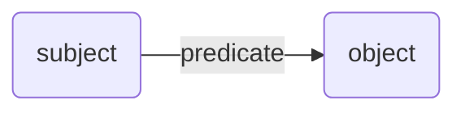
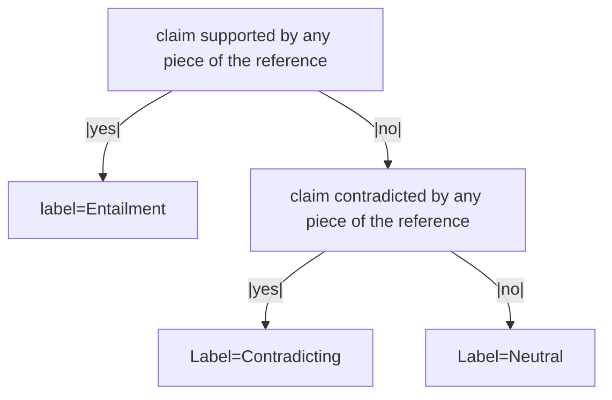

---
created:
  - 2024-11-18T15:16
modified: 2024-11-26 15:42
tags:
  - llm
  - llm-evaluation
  - eval
  - evaluation
  - validation
  - model-validation
  - nlp
  - large-language-model
  - natural-language-processing
type:
  - note
status:
  - completed
---
[RefChecker](https://arxiv.org/abs/2405.14486) is a paper (and framework) released by Amazon AWS AI team in May 2024. It is a "fully automated framework that scales hallucination detection across different tasks" (their words). 

i.e. [RefChecker](https://arxiv.org/abs/2405.14486) is a system for measuring hallucination in large language models (LLMs).

[RefChecker](https://arxiv.org/abs/2405.14486) works by comparing LLM output to known ground truth. i.e. it measures the agreement between the LLM answer to a user question against the known correct answer to the question.   

## Example

| Step | Explanation                                                                                                                                                                                                                                                                                                                                                         | Example                                                                                                                                                                                                                                                                                                                                                                                                                                                                                 |
| ---- | ------------------------------------------------------------------------------------------------------------------------------------------------------------------------------------------------------------------------------------------------------------------------------------------------------------------------------------------------------------------- | --------------------------------------------------------------------------------------------------------------------------------------------------------------------------------------------------------------------------------------------------------------------------------------------------------------------------------------------------------------------------------------------------------------------------------------------------------------------------------------- |
| 1    | LLM is presented with a user query<br>(to which there is a known correct answer)                                                                                                                                                                                                                                                                                    | Query: “What are the common side effects of ibuprofen?”<br><br>Correct answer (ground truth): “Common side effects of ibuprofen are headaches, dizziness and nausea. Difficulty breathing is not a common side effect.”                                                                                                                                                                                                                                                                 |
| 2    | LLM generates a response to the user query                                                                                                                                                                                                                                                                                                                          | LLM answer: “Ibuprofen is a commonly used nonsteroidal anti-inflammatory drug (NSAID) that helps reduce inflammation, pain, and fever. Common side effects of ibuprofen include nausea, giddiness and respiratory trouble.”                                                                                                                                                                                                                                                             |
| 3    | An “extractor” LLM extracts knowledge triplets from the LLM response ([prompt used for the extractor](#The%20prompt%20used%20for%20the%20extractor))                                                                                                                                                                                                                | <I used ChatGPT 4o mini>  <br>("Ibuprofen", "is", "nonsteroidal anti-inflammatory drug (NSAID)")  <br>("Ibuprofen", "helps reduce", "inflammation")  <br>("Ibuprofen", "helps reduce", "pain")  <br>("Ibuprofen", "helps reduce", "fever")  <br>("Ibuprofen", "common side effects include", "nausea")  <br>("Ibuprofen", "common side effects include", "giddiness")  <br>("Ibuprofen", "common side effects include", "respiratory trouble")                                          |
| 4    | A “checker” LLM labels each extracted knowledge triplet as one of:<br>- “Entailment”: ground truth reference supports the claim<br>- “Neutral”: ground truth reference neither supports nor contradicts the claim<br>- “Contradicting”: ground truth reference contradicts the claim<br>([prompt used for the checker](#The%20prompt%20used%20for%20the%20checker)) | <I used ChatGPT 4o mini>  <br>NEUTRAL ("Ibuprofen", "is", "nonsteroidal anti-inflammatory drug (NSAID)")NEUTRAL ("Ibuprofen", "helps reduce", "inflammation")NEUTRAL ("Ibuprofen", "helps reduce", "pain")  <br>NEUTRAL ("Ibuprofen", "helps reduce", "fever")  <br>ENTAILMENT ("Ibuprofen", "common side effects include", "nausea")NEUTRAL ("Ibuprofen", "common side effects include", "giddiness")CONTRADICTION ("Ibuprofen", "common side effects include", "respiratory trouble") |
| 5    | The distribution of assigned labels is used to create model evaluation metrics                                                                                                                                                                                                                                                                                      | 14%  \|\|          ENTAILMENT  <br>72%  \|\|\|\|\|\|\|      NEUTRAL  <br>14%  \|\|          CONTRADICTION                                                                                                                                                                                                                                                                                                                                                                               |

## Claim Triplets 
[RefChecker](https://arxiv.org/abs/2405.14486) uses *claim triplets* (or *knowledge triplets*) in order to represent a *single unit of factual information*. *Claim triplets* have the form: 

$$\underset{\text{Claim Triplet}
}{\underbrace{\Big(\text{subject}, \hspace{3mm} \text{predicate}, \hspace{3mm} \text{object}\Big)}}$$



Examples of *claim triplets*:
- (Water) --is a--> (liquid)
- (Heal the World) --was recorded by--> (Michael Jackson)
- (Albert Einstein) --was born in--> (Ulm, Germany)

*Claim* (or *knowledge*) *triplets* are a standard way to represent the relation between 2 conceptual entities, used in many different domains (e.g. knowledge graphs). You can see more examples of *claim triplets* in [the prompt used for the extractor model](#The%20prompt%20used%20for%20the%20extractor).
## How RefChecker Works
1. A LLM generates an answer to a user question, for which there is a known correct answer (the *reference*). The answer could be generated on the LLMs own knowledge, from noisy context (RAG), or from clean context (e.g. summarisation or information extraction).
2.  A different LLM (the claim *extractor*) is used to extract a set of *claim-triplets* from the LLM response. See [the prompt used for the extractor (from the original paper)](#The%20prompt%20used%20for%20the%20extractor)
3. Another LLM (the claim *checker*) labels each extracted *claim triplet* as one of:
	1. "Entailed" - the claim (information) in the LLM response is included in (and is in agreement with) the ground truth *reference* (known correct answer) i.e. ***the LLM claim is correct***.
	2. "Contradicting" - the claim (information) in the LLM response is not supported by any information in the the ground truth *reference* (known correct answer), **and** there is information in the ground truth *reference* which actively contradicts the LLM response i.e. ***The LLM claim is incorrect***.
	3. "Neutral" - the claim (information) in the LLM response is not included in the ground truth *reference* (known correct answer), or nothing in the ground truth *reference* contradicts the LLM claim i.e. ***we don't know whether the LLM claim is correct or not***  
	   See [the prompt used for the checker (from the original paper)](#The%20prompt%20used%20for%20the%20checker).

  In order to measure the amount of hallucination in a particular LLM response, the hallucination distribution can be reported (i.e. the relative proportions of entailing, neutral and contradictory claims).
  A particular LLM can be globally assessed across all of it's responses by taking a macro average across it's claim ratios (i.e. mean %entailment, mean %neutral, mean %contradicting across all LLM responses).    
## The prompt used for the extractor
This is the prompt used for the *claim-triplet* *extractor* LLM, from [the original RagChecker paper](https://arxiv.org/abs/2405.14486).
I don't know why there are so many grammatical errors in it - it may be that the authors are not first-language English speakers, or that the paper on Arxiv is a preprint.
(note: "*KG*" is a [Knowledge Graph](https://en.wikipedia.org/wiki/Knowledge_graph))

```
Given a question and a candidate answer to the question, please extract a KG from the candidate answer condition on the question and represent the KG with triples formatted with ("subject", "predicate", "object"), each triplet in a line.
Please note that this is an EXTRACTION task, so DO NOT care about whether the content of the candidate answer is factual or not, just extract the triplets from it.

Here are some in-context examples:

### Question:
Given these paragraphs about the Tesla bot, what is its alias?

### Candidate Answer:
Optimus (or Tesla Bot) is a robotic humanoid under development by Tesla, Inc. It was announced at the company's Artificial Intelligence (AI) Day event on August 19, 2021.

### KG:
("Optimus", "is", "robotic humanoid")
("Optimus", "under development by", "Tesla, Inc.")
("Optimus", "also known as", "Tesla Bot")
("Tesla, Inc.", "announced", "Optimus")
("Announcement of Optimus", "occurred at", "Artificial Intelligence (AI) Day event") ("Artificial Intelligence (AI) Day event", "held on", "August 19, 2021")
("Artificial Intelligence (AI) Day event", "organized by", "Tesla, Inc.")

### Question:
here is some text about Andre Weiss, how many years was Andre at University of Dijon in Paris?

### Candidate Answer:
11 years

### KG:
("Andre Weiss at University of Dijon in Paris", "duration", "11 years")
Now generate the KG for the following candidate answer based on the provided question:

### Question:
{q}

### Candidate Answer: 
{a}

### KG:
```

## The prompt used for the checker 
This is the prompt used for the extraction *checker* LLM, from [the original RagChecker paper](https://arxiv.org/abs/2405.14486). Again, I'm not sure why there are so many grammatical errors.

```
I have a claim that made by a language model to a question, please help me for checking whether the claim can be entailed according to the provided reference which is related to the question.
The reference is a list of passages, and the claim is represented as a triplet formatted with ("subject", "predicate", "object").

If the claim is supported by ANY passage in the reference, answer 'Entailment'.
If NO passage in the reference entail the claim, and the claim is contradicted with some passage in the reference, answer 'Contradiction'.
If NO passage entail or contradict with claim, or DOES NOT contain information to verify the claim, answer 'Neutral'.

Please DO NOT use your own knowledge for the judgement, just compare the reference and the claim to get the answer.

### Question: 
{question}

### Reference:
{reference}

### Claim:
{claim}

Your answer should always be only a single word in ['Entailment', 'Neutral', 'Contradiction']. DO NOT add explanations or you own reasoning to the output.
```

## References
* [(paper) RefChecker: Reference-based Fine-grained Hallucination Checker and Benchmark for Large Language Models](https://arxiv.org/abs/2405.14486)
## Related
* [Applied Large Language Model Concepts](Applied%20Large%20Language%20Model%20Concepts.md)
* [RagChecker (paper) - A Fine-grained Framework for Diagnosing Retrieval-Augmented Generation](RagChecker%20(paper)%20-%20A%20Fine-grained%20Framework%20for%20Diagnosing%20Retrieval-Augmented%20Generation.md)